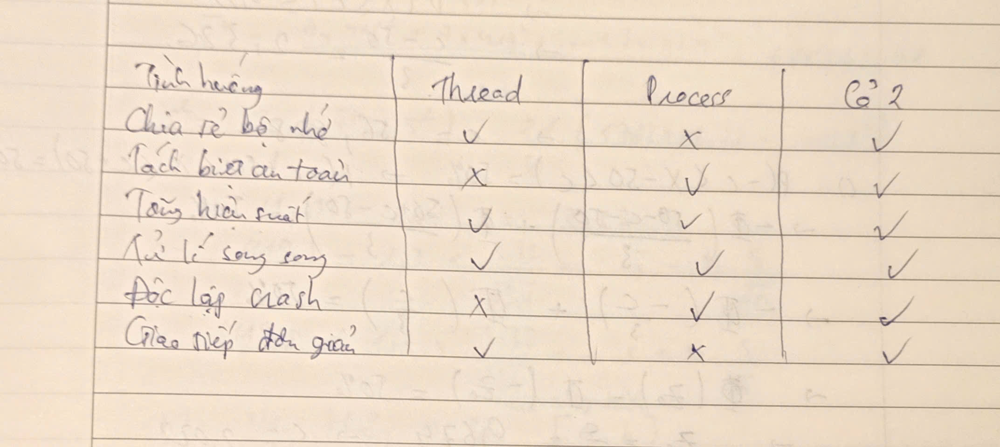

### 1. Dựa vào bài học, check CPU, GPU, RAM, giải thích về hiệu năng của máy tính mà em đang dùng?
    CPU Ryzen 5 5625U: Với 6 nhân 12 luồng, đây là chip tiết kiệm điện nhưng vẫn đủ mạnh để xử lý các tác vụ như lập trình, học máy cơ bản, xử lý văn bản, bảng tính, và cả chỉnh sửa ảnh nhẹ.

    GPU tích hợp Radeon: Không mạnh như GPU rời, nhưng đủ dùng cho đồ họa 2D, xem phim 4K, và chơi game nhẹ.
    
    RAM 8GB: Đủ dùng cho học tập, nhưng nếu bạn chạy nhiều ứng dụng nặng (IDE, máy ảo, trình duyệt nhiều tab), nên nâng cấp lên 16GB.

    SSD NVMe: Tốc độ cao, giúp khởi động máy và mở ứng dụng nhanh chóng.

### 2. 12 bài toán phổ biến sử dụng đa luồng và đa tiến trình

| STT | Bài toán                 | Sử dụng đa luồng/đa tiến trình ở đâu                                |
| --- | ------------------------ | ------------------------------------------------------------------- |
| 1   | Máy chủ web (Web Server) | Mỗi yêu cầu từ client được xử lý bởi một luồng riêng biệt.          |
| 2   | Xử lý ảnh song song      | Chia ảnh thành các phần và xử lý đồng thời bằng nhiều luồng.        |
| 3   | Trình duyệt web          | Mỗi tab hoặc tiện ích mở rộng chạy trong tiến trình riêng.          |
| 4   | Ứng dụng chat            | Gửi và nhận tin nhắn được xử lý bởi các luồng riêng biệt.           |
| 5   | Phân tích dữ liệu lớn    | Chia nhỏ dữ liệu và xử lý song song bằng đa tiến trình.             |
| 6   | Trò chơi điện tử         | Xử lý đồ họa, âm thanh, và logic game bằng các luồng riêng.         |
| 7   | Hệ thống ngân hàng       | Xử lý giao dịch đồng thời bằng đa tiến trình để đảm bảo an toàn.    |
| 8   | Máy chủ cơ sở dữ liệu    | Mỗi truy vấn được xử lý bởi một tiến trình hoặc luồng riêng.        |
| 9   | Ứng dụng xử lý video     | Mã hóa và giải mã video sử dụng đa luồng để tăng tốc độ.            |
| 10  | Hệ thống nhúng           | Các tác vụ như đọc cảm biến, điều khiển động cơ chạy song song.     |
| 11  | Ứng dụng mạng xã hội     | Tải dữ liệu, hiển thị giao diện, và xử lý thông báo bằng các luồng. |
| 12  | Phần mềm diệt virus      | Quét nhiều tệp cùng lúc bằng đa luồng để tiết kiệm thời gian.       |

### 3. So sánh khi nào nên dùng Thread, Process, hoặc cả hai

### 4.
    ChatGPT được huấn luyện trên hệ thống phân tán gồm hàng ngàn GPU kết nối qua mạng tốc độ cao. Một số điểm chính:

    - Dữ liệu: hàng trăm tỷ token từ web, sách, mã nguồn, v.v.

    - Mô hình: chia nhỏ mô hình (model parallelism) và dữ liệu (data parallelism) để huấn luyện đồng thời.

    - Công nghệ: sử dụng NVIDIA A100, TPU, PyTorch, DeepSpeed, Megatron-LM, v.v.

    - Hệ thống: chạy trên siêu máy tính như Azure AI Supercomputer.

Tài liệu tham khảo:[link](https://arxiv.org/abs/2304.13712)