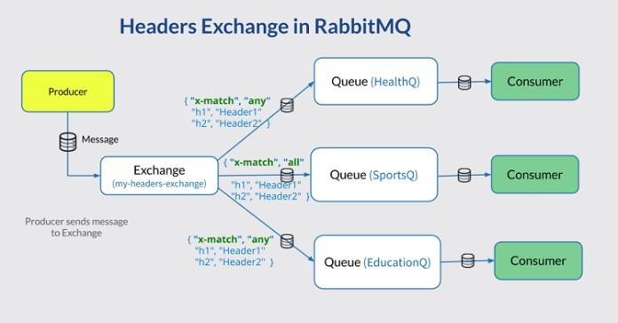

## Bài tập 1: Tìm hiểu về RabbitMQ - Dịch vụ Message Queue phổ biến

### 1. Giới thiệu về RabbitMQ

RabbitMQ là một message broker (môi giới tin nhắn) mã nguồn mở, hỗ trợ nhiều giao thức messaging. RabbitMQ được viết bằng ngôn ngữ Erlang và được phát triển dựa trên tiêu chuẩn AMQP (Advanced Message Queuing Protocol).

### 2. Cơ chế hoạt động

RabbitMQ hoạt động dựa trên các thành phần chính:

1. **Producer**: Ứng dụng gửi message
2. **Queue**: Nơi lưu trữ message
3. **Consumer**: Ứng dụng nhận message
4. **Exchange**: Điểm trung gian nhận message từ producer và route đến queue



### 3. Các chức năng chính

1. **Message Queuing**: 
   - Lưu trữ message trong queue
   - Đảm bảo tin nhắn được gửi đúng thứ tự FIFO
   - Hỗ trợ nhiều consumer xử lý song song

2. **Routing Patterns**:
   - Direct Exchange
   - Topic Exchange
   - Fanout Exchange
   - Headers Exchange

3. **Reliability**:
   - Message acknowledgments
   - Publisher confirms
   - High availability với clustering

4. **Management & Monitoring**:
   - Web UI quản lý
   - HTTP API
   - Command line tool

### 4. Hướng dẫn cài đặt và sử dụng

#### 4.1 Cài đặt RabbitMQ

```bash
# Trên Ubuntu
sudo apt-get update
sudo apt-get install rabbitmq-server

# Trên Windows (sử dụng Chocolatey)
choco install rabbitmq
```

#### 4.2 Code ví dụ với Python

```python
# Producer
import pika

connection = pika.BlockingConnection(pika.ConnectionParameters('localhost'))
channel = connection.channel()
channel.queue_declare(queue='hello')
channel.basic_publish(exchange='',
                     routing_key='hello',
                     body='Hello World!')
```

```python
# Consumer
import pika

def callback(ch, method, properties, body):
    print(f" [x] Received {body}")

connection = pika.BlockingConnection(pika.ConnectionParameters('localhost'))
channel = connection.channel()
channel.queue_declare(queue='hello')
channel.basic_consume(queue='hello',
                     auto_ack=True,
                     on_message_callback=callback)
channel.start_consuming()
```

## Bài tập 2: Các thư viện RPC phổ biến

### 1. gRPC

gRPC là framework RPC hiện đại được phát triển bởi Google, sử dụng Protocol Buffers.

**Ưu điểm:**
- Hiệu năng cao với Protocol Buffers
- Hỗ trợ streaming
- Đa nền tảng, đa ngôn ngữ
- Tích hợp tốt với microservices

**Ví dụ với Python:**

```python
# Proto file
syntax = "proto3";
service Greeter {
  rpc SayHello (HelloRequest) returns (HelloReply) {}
}
message HelloRequest {
  string name = 1;
}
message HelloReply {
  string message = 1;
}
```

### 2. JSON-RPC

JSON-RPC là protocol RPC đơn giản sử dụng JSON để encode data.

**Ưu điểm:**
- Đơn giản, dễ implement
- Dễ debug vì dùng JSON
- Nhẹ nhàng, phù hợp với web services

**Ví dụ với Python:**

```python
from jsonrpc import JSONRPCResponseManager, dispatcher

@dispatcher.add_method
def fib(n):
    if n <= 1: return n
    return fib(n-1) + fib(n-2)

# Handle request
response = JSONRPCResponseManager.handle(
    request_str, dispatcher)
```

### 3. Apache Thrift

Apache Thrift là framework RPC được phát triển bởi Facebook.

**Ưu điểm:**
- Hiệu năng tốt
- Hỗ trợ nhiều ngôn ngữ
- Có thể tùy chỉnh protocol
- Tích hợp với các hệ thống legacy

**Ví dụ IDL (Interface Definition Language):**

```thrift
service Calculator {
    i32 add(1:i32 num1, 2:i32 num2)
    i32 subtract(1:i32 num1, 2:i32 num2)
}
```

### 4. XML-RPC vs Các Alternatives

| Tiêu chí | XML-RPC | gRPC | JSON-RPC | Thrift |
|----------|---------|------|-----------|---------|
| Encoding | XML | Protocol Buffers | JSON | Custom binary |
| Hiệu năng | Thấp | Cao | Trung bình | Cao |
| Dễ sử dụng | Cao | Trung bình | Cao | Trung bình |
| Hỗ trợ ngôn ngữ | Nhiều | Nhiều | Nhiều | Nhiều |
| Streaming | Không | Có | Không | Có |
| Bảo mật | Basic | TLS/SSL | Basic | TLS/SSL |

### Kết luận

Mỗi thư viện RPC có những ưu điểm riêng phù hợp với các use case khác nhau:
- gRPC: Phù hợp với microservices, cần hiệu năng cao
- JSON-RPC: Phù hợp với web services, cần đơn giản
- Thrift: Phù hợp với hệ thống phân tán lớn
- XML-RPC: Phù hợp với hệ thống legacy, cần compatibility cao

Việc lựa chọn thư viện RPC phụ thuộc vào yêu cầu cụ thể của dự án về hiệu năng, tính đơn giản, khả năng mở rộng và môi trường triển khai.
